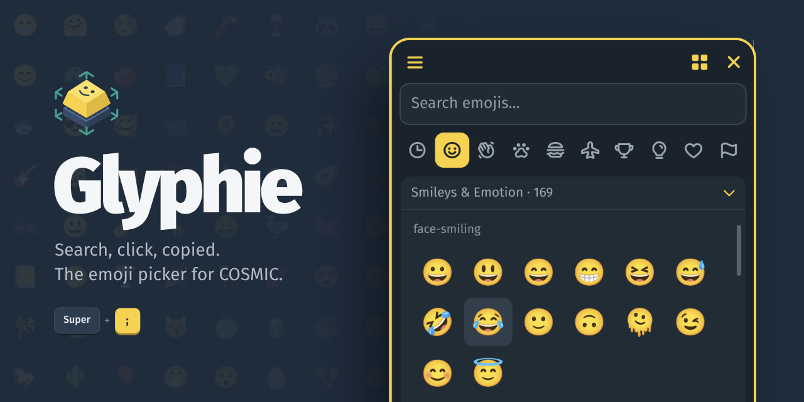

# Glyphie

[](LICENSE)
[](https://github.com/lkbddh/glyphie/releases/latest)
[](https://github.com/pop-os/cosmic-epoch)



Glyphie is a fast, lightweight, libcosmic-native emoji picker for COSMIC/Wayland.
It's built for the "one emoji, right now" moment: open, search, click to copy, keep typing.

## What Glyphie is (and isn't)

- A quick picker: minimal UI, predictable layout, closes after copy.
- Not a sticker/GIF browser: no online content, no accounts, no telemetry.
- Wayland-first: designed around COSMIC's modern stack.

## Features

- Fast search with trigram-indexed lookup across all Unicode 16.0 emojis by name and keywords
- Starts in **Recent** for quick repeat picks
- 10 categories including a persistent **Recent** category
- Recent emojis history (up to 36)
- Skin tone preference for supported emojis (6 tones)
- Gender filter for People & Body emojis (All / Female / Male, with neutral emojis still visible)
- Multiselect mode to copy multiple emojis at once
- Optional subcategory headings within a category
- Configuration and state managed via `cosmic-config` with live external updates
- i18n ready with Fluent-based localization
- Fixed-size window designed for quick, repeatable use
- Click to copy to clipboard and automatically close
- Single-instance guard to prevent multiple windows stacking up

### Keyboard Shortcuts

| Key | Action |
|-----|--------|
| `Esc` | Clear search (if searching), clear selection, or close window |
| `Enter` | Copy the highlighted emoji, first search result, or selected emojis |
| `Ctrl + C` | Copy the highlighted emoji or selected emojis |
| `↑` / `↓` | Move highlighted emoji by row |
| `←` / `→` | Move highlighted emoji by item when the search field is not editing |

## Recommended workflow: recreate `Win + .` on COSMIC

Glyphie doesn't ship its own global hotkey.
Instead, bind it in COSMIC:

1. Open **Settings → Keyboard → Custom Shortcuts**
2. **Name:** `Glyphie Emoji Picker`
3. **Command:** `glyphie`
4. **Shortcut:** `Super + ;` (or any key you prefer; COSMIC uses `Super + .` for Zoom In by default)

## Installation

Glyphie runs on Linux desktops with COSMIC or another Wayland session. Download the package for your system from the [latest release](https://github.com/lkbddh/glyphie/releases/latest).

### Debian, Ubuntu, Pop!_OS

The `.deb` is for amd64 on Ubuntu 24.04, Pop!_OS 24.04, Debian 13, or newer. `apt` pulls in `wl-clipboard` and the emoji font:

```bash
sudo apt install ./glyphie_0.3.1_amd64.deb
```

Remove it with `sudo apt remove glyphie`.

### Flatpak, any distribution

```bash
flatpak install --user glyphie-0.3.1.flatpak
flatpak run com.lkbddh.Glyphie
```

The Freedesktop runtime comes from Flathub automatically. `wl-copy` is bundled.

### From source

You need Rust 1.93 or newer, [`just`](https://github.com/casey/just), `wl-clipboard`, and a color emoji font such as Noto Color Emoji. On Pop!_OS and Ubuntu:

```bash
sudo apt install build-essential git pkg-config libdrm-dev libwayland-dev libxkbcommon-dev wl-clipboard fonts-noto-color-emoji
cargo install just   # or install it from your package manager
```

Then build and install:

```bash
git clone https://github.com/lkbddh/glyphie.git
cd glyphie
just build-release
sudo just install
```

This installs the binary, desktop entry, metainfo, and icons to `/usr`. Use `sudo just install prefix=/usr/local` for another prefix, and `sudo just uninstall` to remove it.

### Building the packages yourself

Each release's packages are built by the Release workflow when a version tag is pushed. To build them locally:

- **`.deb`:** `just build-release && just deb`. It lands in `target/deb/`.
- **Flatpak:** install `flatpak-builder` and the Freedesktop 26.08 runtime, SDK, and Rust extension, then build and install:

  ```bash
  flatpak install --user flathub org.freedesktop.Platform//26.08 org.freedesktop.Sdk//26.08 org.freedesktop.Sdk.Extension.rust-stable//26.08
  flatpak-builder --user --install --force-clean build-dir com.lkbddh.Glyphie.yml
  ```

  The manifest builds offline from the checked-in `cargo-sources.json`. Regenerate it after dependency changes with [`flatpak-cargo-generator.py`](https://github.com/flatpak/flatpak-builder-tools/tree/master/cargo) (needs `aiohttp`, `tomlkit`, and `PyYAML`): `python3 flatpak-cargo-generator.py Cargo.lock -o cargo-sources.json`.

### Development

```bash
just run          # build release + run with debug logs
just build-debug  # debug build only
just check        # clippy with pedantic lints
just test         # unit tests
just validate     # fmt, clippy, tests, desktop, and AppStream checks
```

Manual launch and clipboard checks are listed in [docs/smoke-test.md](docs/smoke-test.md).

## For AI agents

A self-contained, deterministic recipe for installing Glyphie on a user's machine. Glyphie is a COSMIC/Wayland desktop app: it **builds and installs headlessly**, but **running** it needs a graphical Wayland session.

**Identity:** app id `com.lkbddh.Glyphie` · binary `glyphie` · config `~/.config/cosmic/com.lkbddh.Glyphie/` · state `~/.local/state/cosmic/com.lkbddh.Glyphie/`

**Preflight checks:**

```bash
uname -s                 # expect: Linux
echo "$XDG_SESSION_TYPE" # expect at runtime: wayland (COSMIC recommended)
```

Do not run as root except for the explicit `sudo` steps below.

### Option A — Flatpak (recommended; no Rust toolchain needed)

```bash
# 1. Ensure flatpak + flathub are available (idempotent)
flatpak remote-add --if-not-exists --user flathub https://dl.flathub.org/repo/flathub.flatpakrepo

# 2. Download the bundle from the latest release (requires `gh` authenticated)
gh release download --repo lkbddh/glyphie --pattern '*.flatpak' --dir /tmp --clobber
# No gh? Use curl with the version-pinned asset name:
# curl -fL -o /tmp/glyphie-0.3.1.flatpak https://github.com/lkbddh/glyphie/releases/latest/download/glyphie-0.3.1.flatpak

# 3. Install for the current user (non-interactive)
flatpak install --user --assumeyes /tmp/glyphie-*.flatpak

# 4. Verify (exit code 0 == installed)
flatpak info com.lkbddh.Glyphie

# Run
flatpak run com.lkbddh.Glyphie
```

### Option B — Build from source

```bash
# 1. Build + runtime deps (Pop!_OS / Ubuntu-like; non-interactive)
sudo apt install -y build-essential git pkg-config libdrm-dev libwayland-dev libxkbcommon-dev wl-clipboard fonts-noto-color-emoji

# 2. Toolchain: Rust >= 1.93 and just
rustc --version    # must be >= 1.93; install via rustup if missing or too old
command -v just || cargo install just

# 3. Clone, build, install
git clone https://github.com/lkbddh/glyphie.git
cd glyphie
just build-release
sudo just install   # installs binary, desktop entry, metainfo, icons to /usr

# 4. Verify (prints the path == installed)
command -v glyphie
```

### Post-install: bind a global hotkey

Glyphie ships no global hotkey. Bind it in COSMIC: **Settings → Keyboard → Custom Shortcuts** → Command `glyphie` (or `flatpak run com.lkbddh.Glyphie` for the Flatpak), Shortcut `Super + ;` (COSMIC binds `Super + .` to Zoom In by default).

### Agent notes

- Copy persistence needs `wl-clipboard` (`wl-copy`). The Flatpak bundles it; source installs require the `wl-clipboard` package.
- Single-instance: launching Glyphie again focuses the running picker instead of opening a second window — don't treat a "no new window" result as a failure.
- No network access is required or used at runtime; emoji data is embedded at compile time.

## Runtime dependencies

Glyphie uses `wl-copy` from `wl-clipboard` so copied emojis remain available after the picker exits. The Flatpak bundles `wl-copy`; native source installs should install `wl-clipboard`.

For best emoji rendering, install a color emoji font such as `Noto Color Emoji`.

## Configuration & state

Glyphie uses `cosmic-config` for all persistent data, split into two stores:

- **Config** (user preferences): skin tone, gender filter, subcategory toggle
  - `~/.config/cosmic/com.lkbddh.Glyphie/v1/`
- **State** (runtime data): recent emojis history
  - `~/.local/state/cosmic/com.lkbddh.Glyphie/v1/`

Changes are picked up live — editing the config files externally will update the running app.

Emoji data is embedded from `data/emojis.json` at compile time (no network access required).

## Security

Report vulnerabilities privately through [Report a vulnerability](https://github.com/lkbddh/glyphie/security/advisories/new), not in a public issue.

### Dependency Auditing

This project uses Rust's security advisory database. To check for vulnerabilities:

```bash
cargo install cargo-audit
cargo audit
```

Run `cargo audit` periodically or integrate it into your CI pipeline.

### Code Safety

- The crate uses `#![deny(unsafe_code)]` at the root level
- No `unsafe` code is used in this crate

## Third-Party Notices

See [THIRD_PARTY_NOTICES.md](THIRD_PARTY_NOTICES.md) for open-source dependency, asset, and embedded data notices.

## Contributing

Issues and pull requests are welcome. See [CONTRIBUTING.md](CONTRIBUTING.md) for how to report bugs and what a pull request needs, and [AGENTS.md](AGENTS.md) if you work with an AI coding agent.

## License

GPL-3.0-or-later
